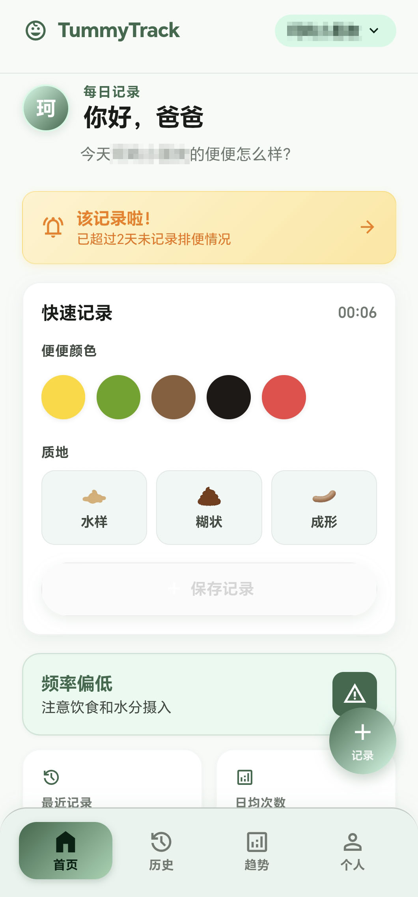
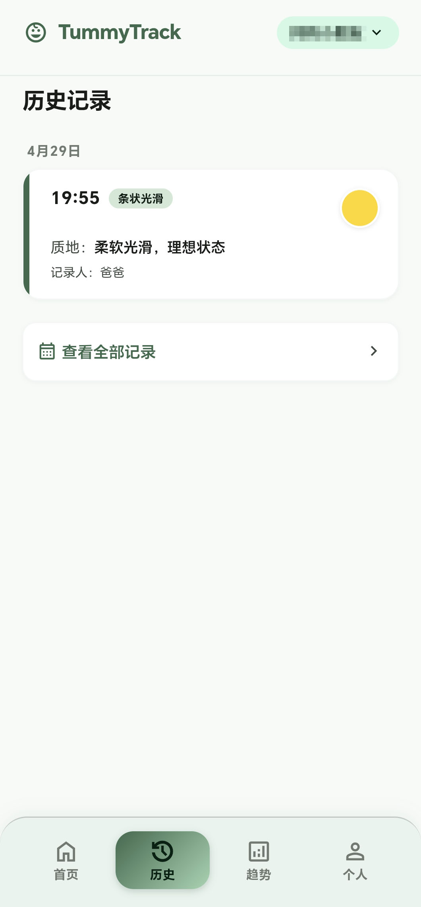
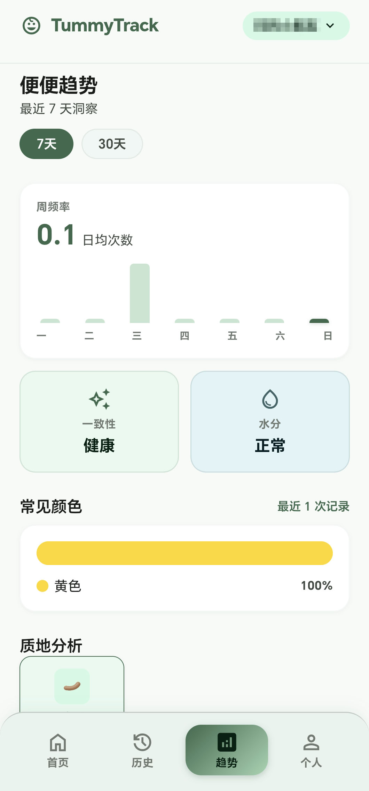
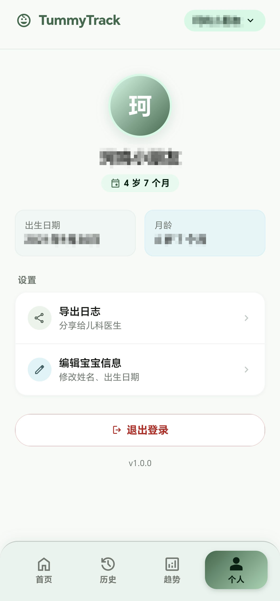

<div align="center">

# 💩 宝宝排便记录

**BabyPoopTracker** — 家庭共享 · 离线可用 · 数据自托管

一款专为家庭设计的宝宝排便记录工具，帮助家长科学追踪宝宝的排便情况，基于布里斯托大便分类法提供健康洞察。

[](https://vuejs.org/)
[](https://expressjs.com/)
[](https://www.sqlite.org/)
[](https://www.docker.com/)
[](https://uniapp.dcloud.net.cn/)

</div>

---

## ✨ 特性

- 🏠 **家庭共享** — 共享密码认证，全家人的手机都能同步记录
- 📴 **离线可用** — 本地存储优先，断网也能正常记录，联网后自动同步
- 🔒 **数据自托管** — 不依赖任何第三方云服务，数据完全由你掌控
- 👶 **多宝宝管理** — 支持记录多个宝宝的排便情况，轻松切换
- 📊 **科学分析** — 基于布里斯托大便分类法，提供健康洞察和趋势分析
- 📅 **日历视图** — 月/年视图直观查看排便规律
- 📤 **数据导出** — 支持 JSON / CSV 格式导出
- 🐳 **一键部署** — Docker Compose 一条命令启动后端服务
- 🎨 **深色模式** — 支持明暗主题切换
- 👴 **老人友好** — 大触控目标、高对比度设计，长辈也能轻松使用

## 📱 应用截图

| 首页 | 历史记录 |
|:---:|:---:|
|  |  |

| 趋势分析 | 个人中心 |
|:---:|:---:|
|  |  |

## 🏗️ 项目架构

```
babypo/
├── src/                        # 前端 (uni-app + Vue 3 + TypeScript)
│   ├── components/             # 公共组件
│   │   ├── bottom-nav-bar.vue  # 底部导航栏
│   │   ├── quick-log-card.vue  # 快速记录卡片
│   │   ├── record-item.vue     # 记录条目
│   │   ├── type-selector.vue   # 类型选择器
│   │   └── ...
│   ├── composables/            # 组合式函数
│   ├── constants/              # 常量定义（布里斯托分类等）
│   ├── pages/                  # 页面
│   │   ├── home/               # 首页仪表盘
│   │   ├── add-record/         # 添加/编辑记录
│   │   ├── history/            # 历史记录
│   │   ├── calendar/           # 日历视图
│   │   ├── trends/             # 趋势分析
│   │   ├── statistics/         # 数据统计
│   │   ├── baby-manage/        # 宝宝管理
│   │   ├── settings/           # 设置
│   │   ├── config/             # 服务器连接配置
│   │   └── profile/            # 个人资料
│   ├── services/               # API 和同步服务
│   ├── stores/                 # Pinia 状态管理
│   ├── types/                  # TypeScript 类型定义
│   └── utils/                  # 工具函数
│
├── server/                     # 后端 (Express + SQLite)
│   ├── src/
│   │   ├── routes/             # API 路由
│   │   │   ├── auth.js         # 认证
│   │   │   ├── records.js      # 记录 CRUD
│   │   │   ├── babies.js       # 宝宝管理
│   │   │   ├── sync.js         # 数据同步
│   │   │   ├── statistics.js   # 统计分析
│   │   │   └── export.js       # 数据导出
│   │   ├── middleware/         # 中间件（认证、错误处理）
│   │   ├── db/                 # 数据库初始化
│   │   └── utils/              # 工具函数
│   ├── Dockerfile
│   └── package.json
│
└── docker-compose.yml          # Docker 一键部署配置
```

## 🚀 快速开始

### 前提条件

- [Node.js](https://nodejs.org/) >= 18
- [Docker](https://www.docker.com/) (推荐，用于后端部署)
- [HBuilderX](https://www.dcloud.io/hbuilderx.html) (用于 App 开发和打包)

### 1. 启动后端服务

**方式一：Docker 部署（推荐）**

```bash
# 克隆项目
git clone https://github.com/your-username/babypo.git
cd babypo

# 一键启动
docker compose up -d
```

服务将在 `http://localhost:3000` 启动。

**方式二：手动启动**

```bash
cd server

# 安装依赖
npm install

# 配置环境变量
cp .env.example .env
# 编辑 .env 修改 JWT_SECRET 和 PASSWORD

# 启动服务
npm run dev
```

### 2. 运行前端 App

```bash
# 在项目根目录安装依赖
npm install

# H5 开发模式
npm run dev:h5

# 或使用 HBuilderX 打开项目，运行到 Android/iOS 设备
```

### 3. 连接服务器

首次打开 App 后，在配置页输入服务器地址（如 `http://192.168.1.100:3000`）和共享密码即可开始使用。

## ⚙️ 环境变量

| 变量 | 说明 | 默认值 |
|------|------|--------|
| `PORT` | 服务端口 | `3000` |
| `JWT_SECRET` | JWT 签名密钥（生产环境务必修改） | `change-me-in-production` |
| `PASSWORD` | 登录密码 | `123456` |
| `DB_PATH` | SQLite 数据库文件路径 | `./data/babypoop.db` |

## 🔌 API 概览

所有 API 路径前缀为 `/api/v1/`

| 模块 | 方法 | 路径 | 说明 |
|------|------|------|------|
| 认证 | POST | `/auth/login` | 密码登录，获取 JWT Token |
| 记录 | GET | `/records` | 获取记录列表 |
| 记录 | POST | `/records` | 新增记录 |
| 记录 | PUT | `/records/:id` | 更新记录 |
| 记录 | DELETE | `/records/:id` | 删除记录 |
| 宝宝 | GET | `/babies` | 获取宝宝列表 |
| 宝宝 | POST | `/babies` | 新增宝宝 |
| 宝宝 | PUT | `/babies/:id` | 更新宝宝信息 |
| 同步 | POST | `/sync/push` | 推送本地变更 |
| 同步 | POST | `/sync/pull` | 拉取服务端变更 |
| 统计 | GET | `/statistics` | 获取统计数据 |
| 导出 | GET | `/export/json` | 导出 JSON |
| 导出 | GET | `/export/csv` | 导出 CSV |
| 健康检查 | GET | `/health` | 服务健康状态（完整路径 `/api/v1/health`） |

## 🔄 同步机制

```
┌─────────────┐    30s 轮询    ┌─────────────┐
│   App 本地   │ ◄──────────► │  自托管服务端  │
│  (Pinia +    │   Push/Pull   │  (SQLite)    │
│  持久化存储)  │               │              │
└─────────────┘               └─────────────┘
```

- **离线优先**：所有操作先写入本地存储，确保断网可用
- **自动同步**：联网后每 30 秒自动 Push/Pull 一次
- **冲突解决**：采用 Last-Write-Wins 策略，以 `updatedAt` 较大者为准
- **同步状态**：`synced` / `syncing` / `offline` / `error` 四种状态实时显示

## 🧪 布里斯托大便分类法

本项目基于医学界广泛使用的布里斯托大便分类法（Bristol Stool Scale），将便便分为 7 种类型：

| 类型 | 名称 | 描述 | 健康提示 |
|------|------|------|----------|
| Type 1 | 硬球状 | 颗粒状，难以排出 | ⚠️ 便秘 |
| Type 2 | 条状凹凸 | 表面凹凸不平 | ⚠️ 轻度便秘 |
| Type 3 | 条状裂纹 | 表面有裂纹 | ✅ 正常偏干 |
| Type 4 | 条状光滑 | 柔软光滑 | ✅ 理想状态 |
| Type 5 | 软团状 | 边缘清晰 | ✅ 正常偏软 |
| Type 6 | 糊状 | 蓬松边缘不齐 | ⚠️ 轻度腹泻 |
| Type 7 | 水样 | 完全液体 | ⚠️ 腹泻 |

## 🛠️ 技术栈

| 层级 | 技术 |
|------|------|
| 前端框架 | uni-app (Vue 3 + TypeScript) |
| 状态管理 | Pinia + pinia-plugin-persistedstate |
| 后端框架 | Express.js |
| 数据库 | SQLite |
| 认证 | JWT + bcryptjs |
| 容器化 | Docker + Docker Compose |
| 安全 | Helmet + CORS |

## 📄 License

MIT License

---

<div align="center">

**用 ❤️ 为宝宝的健康成长而做**

</div>
